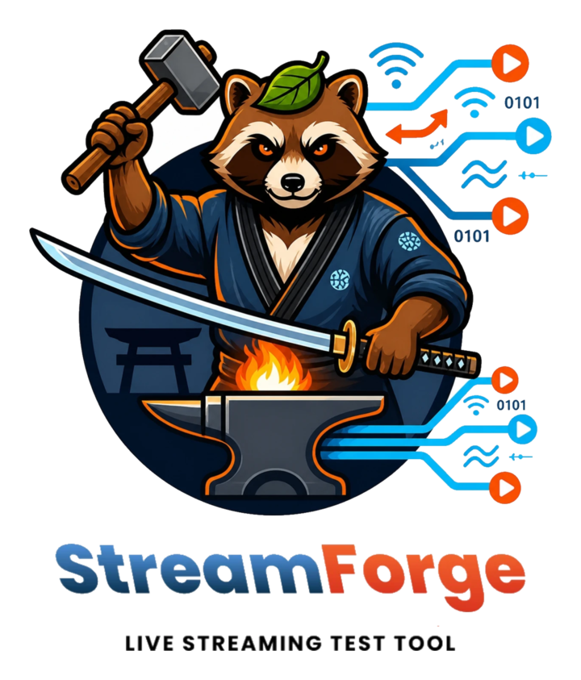
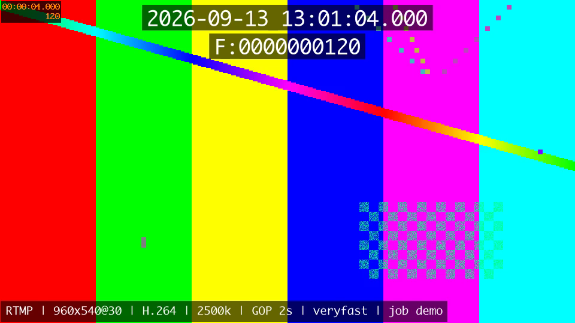

<div align="center">
  <picture>
    <source media="(prefers-color-scheme: dark)" srcset="docs/images/brand/lockup-dark.png">
    
  </picture>
</div>

**配信先URLを貼って、開始を押す。それだけ。**
ライブ配信のエンコードテストをサーバー完結で行うツール。

> A server-side live encoding test tool. Paste an ingest URL and hit start — the protocol is
> detected from the URL, encoder settings are remembered automatically, and the outgoing video
> carries a burned-in millisecond clock plus its own encoding parameters, so a single screenshot
> on the receiving end tells you both the latency and the settings.



*受信側で保存したフレーム。上段に壁時計とフレーム番号、下段に送出設定が焼き込まれている。*

---

## 何を解決するか

テスト送出のたびに端末で OBS を立ち上げ、プロトコルを選び、SRT の streamid や passphrase を
手打ちする。その手間をなくします。

| 従来 | StreamForge |
|---|---|
| OBSを起動してシーンとソースを選ぶ | ブラウザを開く |
| プロトコルを選ぶ | **URLから自動判定** |
| ビットレート・GOP・presetを設定し直す | **既定値のまま送出。変えたら自動でテンプレート化** |
| 遅延はスマホで画面を撮って比較 | **映像にミリ秒時計を焼き込み**、受信画面のスクショ1枚で確認 |
| 端末を占有するので長時間試験ができない | サーバー常駐。24時間送出も放置できる |
| 失敗すると `Input/output error` だけが残る | **原因の説明に翻訳**し、切り分け手段を案内する |

## 主な機能

**送出先**
- **URLからプロトコルを自動判定** — `rtmp://` `srt://` `https://`(WHIP) を貼るだけ。streamid / latency / passphrase / ストリームキーを分解して表示
- **貼った時点で気づける警告** — FFmpeg の SRT `latency` はマイクロ秒指定、`&&` などの空クエリ、`pbkeylen` 未指定、`mode≠caller` を検出
- **疎通確認** — 最小構成で数秒だけ送ってハンドシェイクの成否を返す。SRT が繋がらないときは induction ハンドシェイクを投げ、「サーバーが居ない」のか「認証情報が違う」のかを切り分ける
- **送出先の保存** — 送出したURLは自動保存。URLは暗号化して持ち、表示・ログ・履歴には伏せ字版だけを出す

**ソース**
- **内蔵テストパターン** — ファイル不要で常に動く
- **ファイルのループ** — 短い素材はデコード済みフレームを保持してループするので、継ぎ目で出力が途切れない
- **外部ライブ/VOD** — HLSのマスタープレイリストから**目的の解像度に合うバリアントを自前で選ぶ**（FFmpeg任せだと最低画質を掴み、起動も遅い）
- **素材の先読み** — ライブ端より手前から読んで貯金を作る。時計はこの後に焼くので**遅延測定には乗らない**

**エンコード**
- **テンプレート自動保存** — 設定を変えて送出すると、名前を付ける操作なしで次回から選べる。同じ内容は1件にまとまり、増えすぎたら自動で整理される
- **処理能力の実測** — その設定で実時間の何倍処理できるかを数秒で測る。送出はしないので配信先に影響しない
- **WebRTC配信先への配慮** — Ceeblue のような WebRTC CDN に送るとき、Bフレーム無効・baseline に落として黒画を防ぐ

**運用**
- **セルフプレビュー** — 送出中の絵を、送出側の画面で毎秒1枚確認できる。オーバーレイを焼いた後のフレームなので、時計まで読める。実測の追加コストは全体の2%・約90kbpsで、**送出と帯域を奪い合わない**（受信側の絵ではない点は画面にも明記）
- **オーバーレイ** — 壁時計（ミリ秒）／フレーム番号／エンコード設定を焼き込む
- **見た目** — light（標準・明るい地）／dark（標準・暗い地）／terminal（端末・緑の燐光と等幅）／tactical（軍用装備・艶のない面と硬い影）／typewriter（原稿用紙・赤インク一色と明朝）の5シーン。既定はOSの設定に従い（light か dark）、選べばそちらが優先される。本文は 4.5:1、UI部品・境界・系列色は 3:1 以上を5シーンすべてで満たす（`python3 tools/check-contrast.py` で検証）
- **監視だけの画面** — 稼働中・終了済みのジョブは `/jobs/<id>` で直に開ける。設定の操作は置かないので、別タブに出しっぱなしにできる（認証はないので、URLを人に配る使い方はしないこと）
- **自動再接続** — 指数バックオフで立て直し、回数を記録する（静かに直さない）
- **定期ログ** — 順調なとき FFmpeg は何も言わないので、60秒ごとに稼働状況を残す
- **結果のJSON保存** — 経時の指標・指摘の履歴・ログ・設定を1ファイルにまとめて落とせる

送出先は限定しません。Ceeblue、J-Stream MOGUL、YouTube Live、自社サーバー、顧客先インジェスト —
URLさえあれば動きます。

## 対応プロトコル

| プロトコル | 状態 |
|---|---|
| RTMP / RTMPS | ✅ |
| SRT (caller) | ✅ |
| WebRTC (WHIP) | ✅ — **openssl を有効にした FFmpeg ビルドが必要** |

## 動作環境

- **macOS (Apple Silicon)** — 開発・運用中の環境
- **Linux** — 移植予定（P5）。OS固有の前提をコードに持ち込まない方針で設計しています
- **FFmpeg** — `libsrt` / `libfreetype`(drawtext) / `openssl`(WHIP) が有効なビルド

```bash
ffmpeg -hide_banner -protocols | grep -wE 'srt|rtmp' && ffmpeg -hide_banner -filters | grep -w drawtext && ffmpeg -hide_banner -muxers | grep -w whip
```

macOS で3つとも揃えるには、tap 版を openssl 付きでビルドします（1〜2分）。

```bash
brew reinstall homebrew-ffmpeg/ffmpeg/ffmpeg --with-openssl@3
```

起動時に能力を検出し、足りないものは画面に表示します。VideoToolbox が無い環境では
自動的に `libx264` へ読み替えます。

## セットアップ

```bash
python3 -m venv .venv && .venv/bin/pip install -r requirements.txt
cp config.example.toml config.toml   # 既定のままで良ければ省略可
./run.sh
```

ブラウザで `http://127.0.0.1:8080` を開き、配信先URLを貼って「送出開始」。

常駐させる場合（macOS / launchd。ログイン時に自動起動し、落ちても起こし直す）：

```bash
./deploy/install-launchagent.sh
```

受信側が手元に無いときは、FFmpeg 自身を受け口にできます。

```bash
ffmpeg -listen 1 -i rtmp://127.0.0.1:11935/live/test -c copy -f null -   # RTMP
ffmpeg -i 'srt://127.0.0.1:19000?mode=listener' -c copy -f null -        # SRT
```

WHIP の受け口には [mediamtx](https://github.com/bluenviron/mediamtx) が使えます。

テスト：

```bash
.venv/bin/python -m unittest discover -s tests -t .
```

## 設定（`config.toml`）

| 項目 | 既定 | 備考 |
|---|---|---|
| `server.host` / `port` | `127.0.0.1` / `8080` | **認証がないので外部に晒さないこと**。リモートからは VPN 等で |
| `ffmpeg.path` | `ffmpeg` | ビルドを差し替えるときはここ |
| `paths.data_dir` / `media_dir` / `log_dir` | `~/StreamForge/...` | DB・素材・ログの置き場所 |
| `job.default_duration_sec` | `7200` | 自動停止までの秒数。**`0` で無期限** |
| `overlay.font_path` | 自動検出 | 空なら同梱→OS標準の順に探す |
| `overlay.ntp_server` | `time.apple.com` | 時刻同期の確認先 |

### 見た目（シーン）

画面の色・書体・形は `app/static/theme.css` のセマンティックトークンだけで決まります。
切り替えは `<html data-scene="light|dark|terminal|tactical|typewriter">` の1属性です。
`:root` が light の既定値で、残りの4シーンが上書きします。
`style.css` は色・書体・角丸・線幅・影を直接書かず、必ず `var()` 経由で引きます
（`--bg` / `--surface` / `--surface-well` / `--text` / `--text-muted` / `--text-disabled` /
`--border` / `--border-strong` / `--accent` / `--accent-hover` / `--on-accent` /
`--success` / `--warning` / `--danger` と各 `--on-*` / `--focus-ring` / `--chart-1〜5` /
`--font-ui` / `--font-mono` / `--font-display` / `--radius` / `--border-width` / `--shadow` ほか）。

シーンを足すときは theme.css に1ブロック追加し、`index.html` の先読みスクリプトと
切り替えボタン、`app.js` の `SCENES` にも足してください（食い違うとテストが落ちます）。

| コマンド | 用途 |
|---|---|
| `python3 tools/check-contrast.py` | 全シーンの検証。色覚シミュレーションの自己診断を先に通す |
| `python3 tools/palette-search.py <scene>` | 系列色の探索。色相の範囲と制約はここに書く |
| `python3 tools/theme-review.py` | レビュー用の資料を `docs/theme-review.html` に出す |
| `python3 tools/theme-review.py --mark-reviewed` | レビューが通った版を差分の基準にする |

検証の下限は本文 4.5:1、UI部品・境界・系列色 3:1、系列色どうしの ΔE76 25、
白黒にしたときの明度差 ΔL* 8。シーン別に変えた分は
`docs/theme-review.html` の「下限を変えた記録」に理由つきで残します。

**typewriter だけ例外があります。** 赤インクと無彩色しか使わない設計なので、
系列色の ΔE76 は判定しません（色相成分がほぼゼロで、ΔE が ΔL* と一致するため）。
かわりに ΔL* の下限を 10 に上げ、**線種の併用を必須**にしています。
割り当ては `style.css` の `.series-1`〜`.series-5`（実線・破線・点線・一点鎖線・二点鎖線）で、
theme.css のコメントと一対一。片方だけ変えるとテストが落ちます。

## API

| メソッド | パス | 用途 |
|---|---|---|
| GET | `/api/system/capabilities` | FFmpegの能力検出結果・フォント |
| GET | `/api/system/clock` | 時刻同期のずれ |
| POST | `/api/targets/resolve` | URL→プロトコル判定とパラメータ分解 |
| GET/POST/DELETE | `/api/targets[/{id}]` | 送出先の一覧・保存・削除 |
| POST | `/api/targets/test` | 疎通確認 |
| GET | `/api/sources` | 素材とカタログの一覧 |
| POST | `/api/sources/upload` | 素材のアップロード |
| DELETE | `/api/sources/{name}` | 素材の削除 |
| GET/PATCH/DELETE | `/api/templates[/{id}]` | テンプレート |
| GET | `/api/defaults` | 前回の選択（画面の初期値） |
| POST | `/api/jobs/preview` | 実行せずコマンドだけ生成 |
| POST | `/api/jobs/benchmark` | 処理能力の実測（送出しない） |
| POST/GET/DELETE | `/api/jobs[/{id}]` | 送出の開始・参照・停止 |
| GET | `/api/jobs/{id}/events` | 進捗・ログ・指摘のSSE |
| GET | `/api/jobs/{id}/report` | 結果のJSON（`log=full`/`none`） |

## 実装状況

| Phase | 内容 | 状態 |
|---|---|:---:|
| P0 | 土台（FastAPI + SQLite、Command Builder、ジョブ管理、SSE） | ✅ |
| P1 | URL自動判定・疎通確認・送出先の保存 | ✅ |
| P2 | テンプレート自動保存 | ✅ |
| P3 | オーバーレイ（時計・設定の焼き込み） | ✅ |
| P4 | ソース3種と運用性（自動再接続・エラー翻訳） | ✅ |
| P5 | **Linux移植** | — |
| P6 | WebRTC (WHIP) | ✅ |

## 実測して分かったこと

このツールを作る過程で踏んだ罠。同じところで詰まらないための記録です。
詳細と数値は[機能設計書](docs/機能設計書.md)にあります。

| 事象 | 分かったこと |
|---|---|
| WebRTC CDN で**映像だけ真っ暗** | ブラウザは constrained baseline でネゴシエートし、**Bフレームを運べない**。音声はCDNが変換するので正常に聞こえ、切り分けを誤らせる |
| SRT の `latency=200` が効かない | **FFmpeg の SRT latency はマイクロ秒**。Haivision系の資料はミリ秒表記で、そのまま貼ると 0.2ms になる |
| 外部ソースの**画質が落ちる・起動が遅い** | FFmpeg にマスタープレイリストを渡すと**先頭＝最低画質**を掴み、全バリアントを開きにいく（23.5秒→4.3秒、224x100→1680x750） |
| 1080p60 で処理落ち | **`-re` は映像と音声を両方符号化すると間欠的に 0.81x に落ちる**。`realtime` フィルタに替えると安定 |
| GPUを使えば速い？ | **逆。** h264_videotoolbox は 1080p60 で 3.5x、libx264 veryfast は 7.3x |
| `speed` が 0.9 なのに遅れている | FFmpegの `speed` は**起動からの累積平均**。瞬間レートで見ないと実態が分からない |

## 制約・注意

- **認証がありません。** `127.0.0.1` バインド前提です。インターネットに直接晒さないでください
- **同時に送出できるのは1本**です（意図的な制約。リソース管理を単純に保つため）
- `resolved_command` は伏せ字で保存されるため、**コピーしてそのまま実行はできません**（画面共有での流出を防ぐ方を優先）

## ドキュメント

| | |
|---|---|
| [機能設計書](docs/機能設計書.md) | データモデル、機能仕様、API、実測値 |

## ライセンス

MIT（[LICENSE](LICENSE)）。
FFmpeg は GPL ビルドを使いますが、本ツールは FFmpeg を外部プロセスとして起動するだけで
リンクしないため、本体は MIT で配布できます。

`requirements.txt` の依存はすべて許諾的なライセンス（FastAPI/pydantic/pydantic-core:
MIT、Starlette/uvicorn/click/idna: BSD-3-Clause、cryptography/python-multipart:
Apache-2.0）で、MIT配布と両立します（2026-09-23 確認）。
